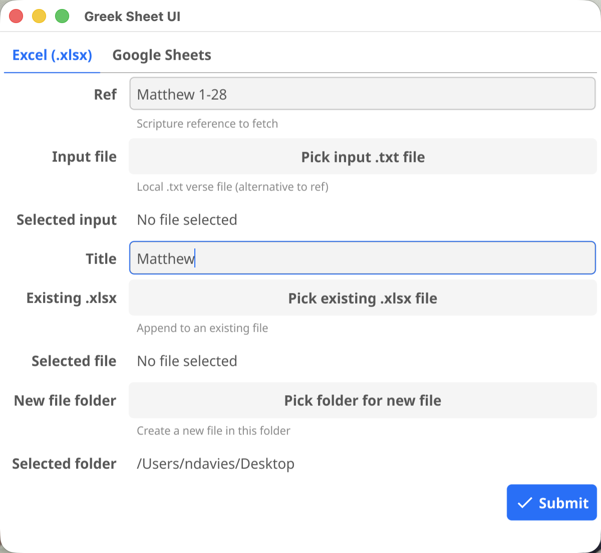
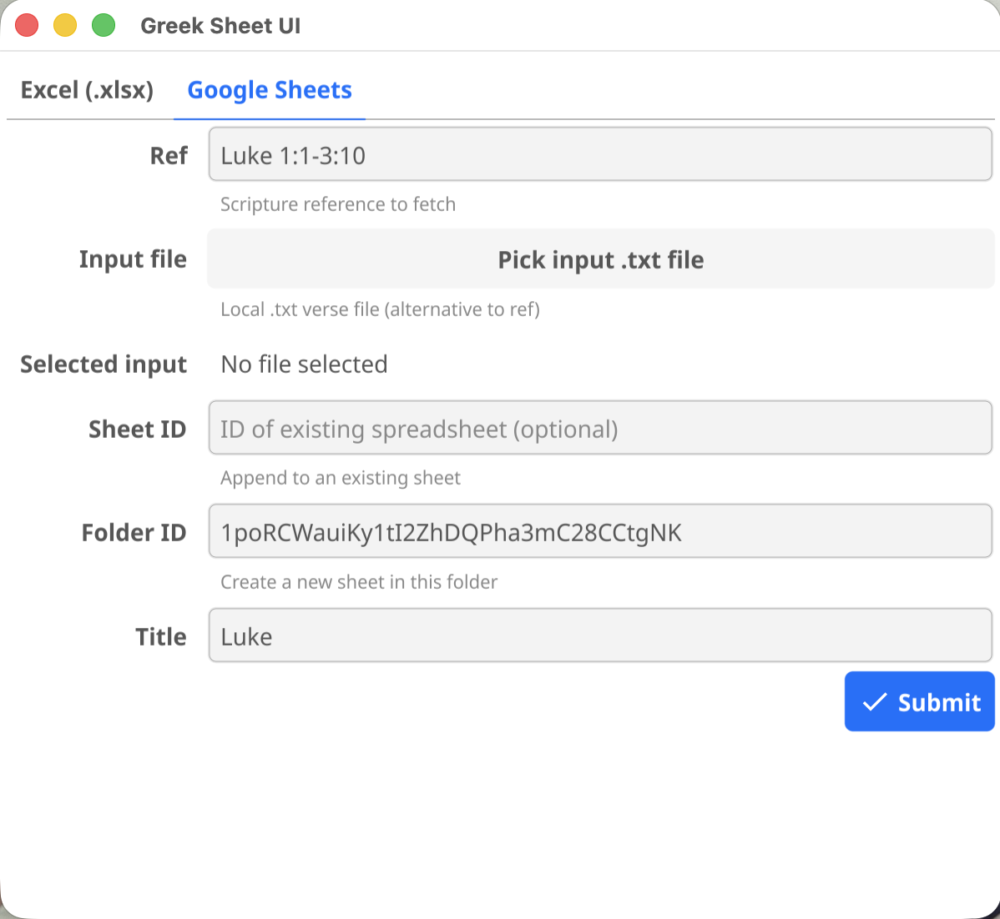

# greeksheet

greeksheet builds beautifully formatted spreadsheets for Greek New Testament
translation practice. Give it a scripture reference and it fetches the Greek
text directly from [greekbible.com](https://greekbible.com), then writes a
structured sheet — one tab per passage — ready to work through verse by verse.

It comes in two forms: a **point-and-click desktop app** (no command line
needed) and a **CLI tool** for scripting or power use.

## What it produces

For each verse the spreadsheet contains eight rows:

| Row label | Colour | Purpose |
|-----------|--------|---------|
| *(verse number + words)* | Grey | The Greek text, one word per cell |
| *(unlabelled × 2)* | *(plain)* | Per-word parsing and individual word-choice work |
| **O** | Blue | Original — the original Greek text for the verse |
| **I** | Orange | Intermediary — assemble your word choices into a coherent sentence |
| **T** | Green | Final translation — your polished English rendering |
| **C** | *(plain)* | Commentary notes |
| **N** | *(plain)* | General notes |

Chapter boundaries appear as bold heading rows. All text is set at 12 pt for
comfortable reading of Greek characters.


## Output modes

greeksheet can write to two destinations — pick whichever suits you:

| Mode | What it produces | Google account needed? |
|------|-----------------|----------------------|
| Google Sheets *(default)* | A spreadsheet in your Google Drive — URL printed at the end | Yes — [see GOOGLE_AUTH.md](GOOGLE_AUTH.md) |
| Excel (`.xlsx`) | A local file on your computer — file path printed at the end | No |

Both modes produce **identical layout and formatting**: the same colour-coded
rows, merged cells, column widths, and 12 pt font.

## Input modes

greeksheet can get its Greek text in two ways:

- **Fetch mode** — give it a scripture reference and it downloads the Greek
  text automatically from greekbible.com. No copy-pasting required.
- **File mode** — point it at a plain-text file you've prepared yourself
  (useful when you want to work from your own source).

## GUI App

The GUI app provides the full feature set in a point-and-click interface —
no Terminal or Command Prompt needed.

| Excel (.xlsx) tab | Google Sheets tab |
|:-----------------:|:-----------------:|
|  |  |

### Download the GUI app

| Platform | File | Instructions |
|----------|------|--------------|
| macOS (Apple Silicon / M-series) | `greeksheetui-darwin-arm64.zip` | Unzip, then double-click `Greek Sheet UI.app` |
| Windows | `greeksheetui-windows-amd64.exe` | Double-click to run |

Download from the [latest UI release](https://github.com/nathj07/greeksheet/releases?q=ui%2Fv&expanded=true) (tags prefixed `ui/v`).

When you first use the Google Sheets tab a browser will open to authorise
access — see [GOOGLE_AUTH.md](GOOGLE_AUTH.md) for details.

> **macOS security note:** The app is ad-hoc signed but not notarized. On first
> launch macOS will show *"Greek Sheet UI" is from an unidentified developer* —
> open *System Settings → Privacy & Security* and click **Open Anyway**.
>
> If you see *"damaged and can't be opened"* instead, run this once in Terminal
> (adjusting the path to wherever you placed the app):
> ```
> xattr -cr "/Applications/Greek Sheet UI.app"
> ```

> **Windows security note:** Some antivirus tools may flag this binary as
> suspicious. This is a known false positive: Go binaries are statically linked
> and have an unusual PE structure that triggers heuristic AV scanners, even
> when the binary is completely safe. The binary is unsigned (no Authenticode
> certificate), which makes the false positive more likely. If your AV
> quarantines the file, add an exception for it. Windows Defender may show
> *"Windows protected your PC"* — click **More info → Run anyway** to continue.

## Authentication (Google Sheets output only)

A browser tab opens on first use to authorise access to your Google account.
After that the token is cached and all subsequent runs are silent. See
[GOOGLE_AUTH.md](GOOGLE_AUTH.md) for full details on token storage, expiry,
and revoking access.

## CLI

The CLI tool is a single binary you run from Terminal (macOS) or Command
Prompt / PowerShell (Windows). It supports all the same output modes and input
modes as the GUI, plus additional flags for scripting — for example appending
multiple passages to the same spreadsheet in one go.

### Download the CLI

| Platform | File |
|----------|------|
| macOS (Apple Silicon / M-series) | `greeksheet-darwin-arm64` |
| Windows | `greeksheet-windows-amd64.exe` |

Download from the [latest CLI release](https://github.com/nathj07/greeksheet/releases?q=v&expanded=true) (tags prefixed `v`).

**macOS** — after downloading, mark the binary as executable and run it:

```bash
chmod +x greeksheet-darwin-arm64
./greeksheet-darwin-arm64 [flags]
```

> **macOS security note:** the first time you run the binary, macOS may block
> it. Go to *System Settings → Privacy & Security* and click **Open Anyway**.

**Windows** — run from PowerShell or CMD:

```
greeksheet-windows-amd64.exe [flags]
```

> **Windows security note:** Some antivirus tools may flag this binary as
> suspicious. This is a known false positive — see the note in the GUI section
> above for details.

When you first run with Google Sheets output a browser will open to authorise
access — see [GOOGLE_AUTH.md](GOOGLE_AUTH.md) for details.

### Input modes in detail

#### Fetch mode (`-ref`)

Pass a scripture reference and greeksheet downloads the Greek text directly
from greekbible.com. Three formats are supported:

| Format | Example | Result |
|--------|---------|--------|
| `"Book ch:v-v"` | `"John 1:1-14"` | Verse range, single tab |
| `"Book ch:v-ch:v"` | `"John 3:36-4:5"` | Cross-chapter range, single tab |
| `"Book ch-ch"` | `"Philippians 1-4"` | Whole chapters, one tab per chapter |
| `"Book ch"` | `"Ephesians 1"` | Single whole chapter |

> Cross-book ranges are not supported. Both endpoints must belong to the same
> book — run each book as a separate command instead.

#### File mode (`-input`)

Point greeksheet at a plain-text file. Lines beginning with `#` become bold
chapter-heading rows; all other non-blank lines are treated as verse text in
the inline format used by greekbible.com.

```
# 1 Corinthians 13
1 Ἐὰν ταῖς γλώσσαις τῶν ἀνθρώπων λαλῶ καὶ τῶν ἀγγέλων, ἀγάπην δὲ μὴ ἔχω, γέγονα χαλκὸς ἠχῶν ἢ κύμβαλον ἀλαλάζον. 2 καὶ ἐὰν ἔχω προφητείαν...
# 1 Corinthians 14
1 Διώκετε τὴν ἀγάπην, ζηλοῦτε δὲ τὰ πνευματικά...
```

You can paste text directly from greekbible.com and save it as a `.txt` file.
Long chapters pasted as a single line are handled correctly.

### Flags

Exactly one of `-input` or `-ref` must be supplied.

| Flag | Default | Description |
|------|---------|-------------|
| `-input` | | Path to a plain-text file of Greek verses (**mutually exclusive with `-ref`**) |
| `-ref` | | Scripture reference to fetch. `"Book ch:v-v"` or `"Book ch:v-ch:v"` for a verse range; `"Book ch-ch"` for whole chapters (one tab each); `"Book ch"` for a single chapter (**mutually exclusive with `-input`**) |
| `-output` | `sheets` | `sheets` (Google Sheets) or `xlsx` (local Excel file) |
| `-title` | filename or ref string | Title for a **new** spreadsheet or file |
| **Google Sheets flags** | | *(only used with `-output sheets`)* |
| `-sheet-id` | *(omit to create new)* | ID of an **existing** spreadsheet to add a tab to (**mutually exclusive with `-folder-id`**) |
| `-folder-id` | *(omit for Drive root)* | Google Drive folder ID to create the new spreadsheet inside (**mutually exclusive with `-sheet-id`**) |
| `-verbose` | `false` | Log Sheets API retry attempts to stderr |
| **Excel flags** | | *(only used with `-output xlsx`)* |
| `-xlsx-file` | | Path to the `.xlsx` file — created if it does not exist, tabs appended if it does |

#### Finding a spreadsheet ID

The ID is the string between `/d/` and the next `/` in the Google Sheets URL:

```
https://docs.google.com/spreadsheets/d/<ID>/edit
```

#### Finding a Drive folder ID

The ID is at the end of the Google Drive folder URL:

```
https://drive.google.com/drive/folders/<FOLDER ID>
```

#### Tab naming

- **Verse-range fetch / file mode**: tab named from the verse range, e.g. `1:1-1:14`.
- **Whole-chapter fetch**: tab named by chapter number, e.g. `1`, `2`, `3`.
- **Excel output**: `:` is not valid in Excel sheet names, so verse-range tabs use `.` instead, e.g. `1.1-1.14`.

### Examples

```bash
# Fetch mode — new Google spreadsheet
./greeksheet-darwin-arm64 -ref "John 1:1-14" -title "John 1"

# Fetch mode — whole book, one tab per chapter
./greeksheet-darwin-arm64 -ref "Philippians 1-4" -title "Philippians"

# Fetch mode — add a tab to an existing spreadsheet
./greeksheet-darwin-arm64 -ref "Romans 8:1-17" -sheet-id <ID>

# Fetch mode — create a spreadsheet in a specific Drive folder
./greeksheet-darwin-arm64 -ref "John 1:1-14" -title "John 1" -folder-id <FOLDER ID>

# File mode — new Google spreadsheet
./greeksheet-darwin-arm64 -input 1cor13.txt -title "1 Corinthians study"

# Excel output — new file (no Google account needed)
./greeksheet-darwin-arm64 -output xlsx -ref "John 1:1-14" -xlsx-file ~/sheets/john.xlsx

# Excel output — whole book
./greeksheet-darwin-arm64 -output xlsx -ref "Ephesians 1-6" -xlsx-file ~/sheets/ephesians.xlsx

# Excel output — append tabs to an existing file
./greeksheet-darwin-arm64 -output xlsx -ref "Philippians 1-4" -xlsx-file ~/study.xlsx
```

## Build from source

Pre-built binaries are provided for macOS and Windows. Linux users, or anyone
who prefers to compile, need Go 1.26 or later.

**CLI:**

```bash
go build -o greeksheet .
./greeksheet [flags]
```

**GUI app** (also requires a C compiler — Xcode CLT on macOS, MinGW on Windows):

```bash
go build ./gui/greeksheetui
```

## Contributing

Contributions are welcome. Here's what you need to know before opening a PR.

### Prerequisites

- Go 1.26 or later
- A Google OAuth client secret for local testing of Sheets output — see [GOOGLE_AUTH.md](GOOGLE_AUTH.md)

### Running tests locally

```bash
go build ./...
go vet ./...
go test ./...
```

All three commands must pass cleanly. The CI workflow enforces the same checks
on every PR.

### Submitting a change

1. **Open an issue first** — describe the bug or feature so it can be discussed
   before any code is written. This avoids wasted effort if the approach needs
   to change.
2. Fork the repo and create a branch from `main`.
3. Make your changes with tests where appropriate.
4. Open a pull request targeting `main` that:
   - References the issue (e.g. `Closes #123` in the description)
   - Includes a clear description of *what* changed and *why*
   - Notes any non-obvious decisions or trade-offs

CI will run automatically. A review from the repo owner is required before
merging — you will be auto-assigned as a reviewer via CODEOWNERS.

## License

MIT — see [LICENSE](LICENSE).
