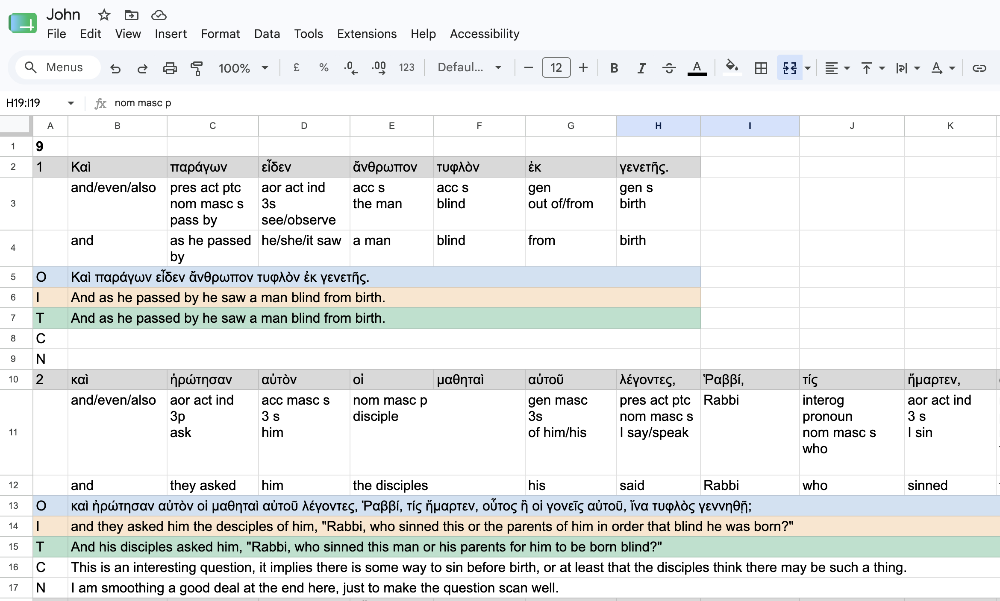

# greeksheet

A command-line tool that builds a formatted Google Sheet for Greek New Testament
translation practice. It supports two input modes and three fetch strategies:

- **File mode** (`-input`): read verses from a plain-text file copied from
  [greekbible.com](https://greekbible.com).
- **Fetch mode** (`-ref`): fetch Greek text directly from greekbible.com for a
  reference range such as `"John 1:1-14"` or `"John 1:50-2:10"` — no copy-pasting
  required. One HTTP request is made per chapter, making it much faster than
  fetching verse-by-verse.
- **Chapter-per-tab mode** (`-ref … -chapter-per-tab`): fetch entire chapters and
  create one Google Sheets tab per chapter, useful for whole-book or multi-chapter
  study ranges like `"Ephesians 1-6"`.

## Download

Pre-built binaries for macOS (Apple Silicon) and Windows are attached to every
[GitHub Release](https://github.com/nathj07/greeksheet/releases/latest).

| Platform | File |
|----------|------|
| macOS (Apple Silicon / M-series) | `greeksheet-darwin-arm64` |
| Windows | `greeksheet-windows-amd64.exe` |

**macOS** — after downloading, mark the binary as executable and run it:

```bash
chmod +x greeksheet-darwin-arm64
./greeksheet-darwin-arm64 [flags]
```

> **macOS security note:** the first time you run the binary, macOS may block it.
> If so, go to *System Settings → Privacy & Security* and click **Open Anyway**.

**Windows** — run from PowerShell or CMD:

```
greeksheet-windows-amd64.exe [flags]
```

### Build from source

If you prefer to compile yourself, you need Go 1.21 or later:

```bash
go build -o greeksheet .
./greeksheet [flags]
```

## What it produces

For each verse the sheet contains six rows:

| Row label | Colour | Purpose                                                                                         |
|-----------|--------|-------------------------------------------------------------------------------------------------|
| *(verse number + words)* | Grey | The Greek text, one word per cell                                                               |
| *(unlabelled × 2)* | *(plain)* | Per-word parsing and individual word-choice work — one cell per Greek word                      |
| **O** | Blue | Original — The original Greek text for the verse; merged across all word columns                |
| **I** | Orange | Intermediary — assemble your word choices into a coherent verse; merged across all word columns |
| **T** | Green | Final translation — write your polished English translation; merged across all word columns     |
| **C** | *(plain)* | Commentary notes, merged across all word columns                                                |
| **N** | *(plain)* | General notes, merged across all word columns                                                   |

Chapter boundaries appear as bold number rows that group the verses beneath
them. In file mode these come from `#` heading lines; in fetch mode they are
inserted automatically whenever the chapter changes.

All text is set at 12 pt for comfortable reading of Greek characters.


Generated using `./greeksheet -sheet-id <my-sheet-id> -ref "John 9:1-23"`, details on the command, and the various flags it supports are provided below.

## Prerequisites

- A Google account
- Go 1.21 or later *(only required if building from source)*

## Authentication

The first time you run greeksheet a browser tab opens asking you to sign in
and approve the requested permissions. After you click **Allow**, the tab
shows "Authentication successful — you can close this tab." and the tool
continues automatically.

The token is cached at `~/.config/greeksheet/token.json` (macOS:
`~/Library/Application Support/greeksheet/token.json`). Every subsequent run
is silent — no browser, no extra steps.

> **Revoking access:** delete the token file above and the browser prompt will
> appear on the next run. You can also revoke access at any time from your
> [Google Account security page](https://myaccount.google.com/permissions).

Refresh tokens are typically valid for ~6 months of inactivity; if yours expires (or is revoked), the next run will ask you to re-authenticate.

## Input modes

### File mode (`-input`)

Create a plain-text file with one or more sections. Lines beginning with `#`
become bold heading rows in the sheet. All other non-blank lines are treated
as a block of verses in the inline format used by greekbible.com — verse
number, followed by the words of that verse, followed by the next verse number,
and so on.

```
# 1 Corinthians 13
1 Ἐὰν ταῖς γλώσσαις τῶν ἀνθρώπων λαλῶ καὶ τῶν ἀγγέλων, ἀγάπην δὲ μὴ ἔχω, γέγονα χαλκὸς ἠχῶν ἢ κύμβαλον ἀλαλάζον. 2 καὶ ἐὰν ἔχω προφητείαν...
# 1 Corinthians 14
1 Διώκετε τὴν ἀγάπην, ζηλοῦτε δὲ τὰ πνευματικά...
```

You can paste text directly from greekbible.com — copy the verse range for a
chapter and save it as a `.txt` file. Long chapters pasted as a single line
are handled correctly.

### Fetch mode (`-ref`)

Pass a reference range and the tool fetches the Greek text directly from
greekbible.com. One HTTP request is made per chapter (not per verse), so a
multi-chapter range is still fast:

```bash
# Same-chapter range
go run . -ref "John 1:1-14" -title "John 1"

# Cross-chapter range — chapter heading inserted automatically
go run . -ref "John 3:36-4:5" -title "John 3–4"

# Multi-word book name
go run . -ref "1 Corinthians 13:1-13" -title "1 Cor 13"
```

The reference format is `"<Book> <chapter>:<verse>-<verse>"` for a same-chapter
range, or `"<Book> <chapter>:<verse>-<chapter>:<verse>"` for a cross-chapter
range. Verses outside the requested range are filtered out in-process after
each chapter page is fetched. Cross-book ranges are not supported.

### Chapter-per-tab mode (`-ref … -chapter-per-tab`)

For multi-chapter study, use a whole-chapter range and the `-chapter-per-tab`
flag. Each chapter is fetched as a single page and written to its own
spreadsheet tab named by chapter number (`"1"`, `"2"`, …):

```bash
# Create a new spreadsheet with one tab per chapter
go run . -ref "Philippains 1-4" -chapter-per-tab -title "Philippians"

# Add tabs to an existing spreadsheet
go run . -ref "Ephesians 1-6" -chapter-per-tab -sheet-id <ID>

# Single chapter
go run . -ref "Romans 8-8" -chapter-per-tab -title "Romans 8"
```

The whole-chapter reference format is `"<Book> <startChapter>-<endChapter>"`.
This format is **only** valid with `-chapter-per-tab`; for verse-range fetches
use the `ch:v-v` format above.

## Usage

Run the downloaded binary directly:

```bash
# macOS
./greeksheet-darwin-arm64 [flags]

# Windows
greeksheet-windows-amd64.exe [flags]
```

If you built from source, use your own binary name:

```bash
./greeksheet [flags]
```

Or run without building:

```bash
go run . [flags]
```

Exactly one of `-input` or `-ref` must be supplied.

### Flags

| Flag | Default | Description |
|------|---------|-------------|
| `-input` | | Path to the input text file of Greek verses (**mutually exclusive with `-ref`**) |
| `-ref` | | Reference range to fetch from greekbible.com. Use `"Book ch:v-v"` or `"Book ch:v-ch:v"` for verse ranges; use `"Book ch-ch"` with `-chapter-per-tab` for whole chapters (**mutually exclusive with `-input`**) |
| `-chapter-per-tab` | `false` | Create one tab per chapter; requires `-ref` with a whole-chapter range like `"Ephesians 1-6"` |
| `-title` | input filename (without extension), or the ref string | Title for a **new** Google Sheet (ignored when `-sheet-id` is used) |
| `-sheet-id` | *(omit to create a new sheet)* | ID of an **existing** Google Spreadsheet to add a new tab to (**mutually exclusive with `-folder-id`**) |
| `-folder-id` | *(omit to create in Drive root)* | Google Drive folder ID to create the **new** spreadsheet inside (**mutually exclusive with `-sheet-id`**) |

### Finding a spreadsheet ID

The spreadsheet ID is the long string of letters and numbers in the Google
Sheets URL, between `/d/` and the next `/`:

```
https://docs.google.com/spreadsheets/d/<ID STRING IS HERE>/edit
```

Copy everything between `/d/` and `/edit` (or the next `/`) and pass it as
`-sheet-id`.

### Finding a Drive folder ID

The folder ID appears in the Google Drive URL when you open a folder:

```
https://drive.google.com/drive/folders/<FOLDER ID IS HERE>
```

Copy the ID at the end of the URL and pass it as `-folder-id`. The new
spreadsheet will be created directly inside that folder — it will never
appear in your Drive root.

### Tab naming

- **File mode / verse-range fetch**: the tab is named from the verse range,
  e.g. `1:1-1:14` or `13:1-14:40`. The book name is omitted — it
  typically appears in the spreadsheet title instead.
- **Chapter-per-tab mode**: each tab is named by chapter number only, e.g.
  `1`, `2`, `3`.

### Examples

```bash
# File mode — create a new spreadsheet; tab named from the verse range
go run . -input 1cor13.txt

# File mode — set a custom spreadsheet title
go run . -input 1cor13.txt -title "1 Corinthians study"

# File mode — add a new tab to an existing spreadsheet
go run . -input 1cor14.txt -sheet-id <ID FROM URL OF EXISTING SHEET>

# Fetch mode — create a new spreadsheet from a reference range
go run . -ref "John 1:1-14" -title "John 1"

# Fetch mode — cross-chapter range
go run . -ref "John 3:36-4:5" -title "John cross-chapter"

# Fetch mode — add a tab to an existing spreadsheet
go run . -ref "Romans 8:1-17" -title "Romans 8" -sheet-id <ID>

# Chapter-per-tab — create a new spreadsheet with 6 tabs (one per chapter)
go run . -ref "Philippians 1-4" -chapter-per-tab -title "Philippians"

# Chapter-per-tab — add tabs to an existing spreadsheet
go run . -ref "Ephesians 1-6" -chapter-per-tab -sheet-id <ID>

# Create a new spreadsheet inside a specific Drive folder
go run . -ref "John 1:1-14" -title "John 1" -folder-id <FOLDER ID FROM DRIVE URL>

# Chapter-per-tab — create a new spreadsheet in a specific Drive folder
go run . -ref "Ephesians 1-6" -chapter-per-tab -title "Ephesians" -folder-id <FOLDER ID FROM DRIVE URL>
```

## Output

### Verse-range fetch (`-ref`)

First run (browser opens once):

```
Authenticating with Google…
Opening browser for Google authentication…
  https://accounts.google.com/o/oauth2/auth?…

Fetching Greek text for "John 1:1-14" from greekbible.com…
  Fetching John chapter 1…
Parsed 14 verses
…

Done! Open your sheet at:
  https://docs.google.com/spreadsheets/d/<sheet-id>
```

Subsequent runs (silent auth):

```
Authenticating with Google…
Fetching Greek text for "John 1:1-14" from greekbible.com…
  Fetching John chapter 1…
Parsed 14 verses
…

Done! Open your sheet at:
  https://docs.google.com/spreadsheets/d/<sheet-id>
```

### Chapter-per-tab (`-ref … -chapter-per-tab`)

```
Authenticating with Google…
Fetching Ephesians chapters 1–6 from greekbible.com…
  Chapter 1: 23 verses
…
  Chapter 6: 24 verses

Done! Open your sheet at:
  https://docs.google.com/spreadsheets/d/<sheet-id>
```

The sheet is automatically shared with "anyone with the link can edit", so you
can open it on any device without extra steps.

## Contributing

Contributions are welcome. Here's what you need to know before opening a PR.

### Prerequisites

- Go 1.21 or later
- A Google OAuth client secret for local testing — see [Build from source](#build-from-source) and [Authentication](#authentication)

### Running tests locally

```bash
go build ./...
go vet ./...
go test ./...
```

All three commands must pass cleanly. The CI workflow enforces the same checks on every PR.

### Submitting a change

1. **Open an issue first** — describe the bug or feature so it can be discussed before any code is written. This avoids wasted effort if the approach needs to change.
2. Fork the repo and create a branch from `main`
3. Make your changes with tests where appropriate
4. Open a pull request targeting `main` that:
   - References the issue (e.g. `Closes #123` in the description)
   - Includes a clear description of *what* changed and *why*
   - Notes any non-obvious decisions or trade-offs

CI will run automatically. A review from the repo owner is required before merging — you will be auto-assigned as a reviewer via CODEOWNERS.

## License

MIT — see [LICENSE](LICENSE).
